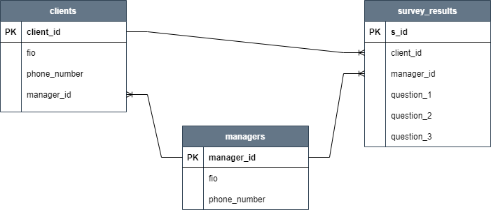

# Задание №11: Работа с индексами, join'ами, статистикой

### 1 вариант: Создать индексы на БД, которые ускорят доступ к данным.

1. Создать индекс к какой-либо из таблиц вашей БД
```
-- Создаем таблицу
CREATE TABLE index_test (id INT, txt TEXT, s_bool BOOL);

-- Заполняем таблицу значениями
insert into index_test(id,txt,s_bool)
  select s.id,
        ((random()*1000)::int)::text || ' ' || ((random()*1000)::int)::text || ' ' || ((random()*1000)::int)::text,
        random() < 0.01
    from generate_series(1,100000) as s(id)
    order by random();

-- Создаем индекс
CREATE INDEX test_id_idx ON index_test (id);
```
2. Прислать текстом результат команды explain, в которой используется данный индекс
```
otusdb=# explain select * from index_test where id = 8735;
                                  QUERY PLAN
------------------------------------------------------------------------------
 Index Scan using test_id_idx on index_test  (cost=0.29..8.31 rows=1 width=23)
   Index Cond: (id = 8735)
(2 rows)
```
3. Реализовать индекс для полнотекстового поиска
```
-- Сначала выполним explain тестового запроса без индекса
explain
select txt, ts_rank_cd(to_tsvector("txt"), query) as rank
    from index_test, to_tsquery('234|324|(671&123)') query
    where query @@ to_tsvector("txt")
    order by rank desc
    limit 10;
                                       QUERY PLAN
----------------------------------------------------------------------------------------
 Limit  (cost=28015.31..28015.34 rows=10 width=15)
   ->  Sort  (cost=28015.31..28016.56 rows=500 width=15)
         Sort Key: (ts_rank_cd(to_tsvector(index_test.txt), query.query)) DESC
         ->  Nested Loop  (cost=0.25..28004.51 rows=500 width=15)
               Join Filter: (query.query @@ to_tsvector(index_test.txt))
               ->  Function Scan on to_tsquery query  (cost=0.25..0.26 rows=1 width=32)
               ->  Seq Scan on index_test  (cost=0.00..1628.00 rows=100000 width=11)

-- Создаем индекс для функции to_tsvector поля txt
create index test_txt_idx on index_test USING GIN (to_tsvector('english', "txt"));

-- Теперь выполним explain еще раз
explain
select txt,
        ts_rank_cd(to_tsvector('english', "txt"), query) as rank
    from index_test, to_tsquery('234|324|(671&123)') query
    where query @@ to_tsvector('english', "txt")
    order by rank desc
    limit 10;
                                             QUERY PLAN
-----------------------------------------------------------------------------------------------------
 Limit  (cost=910.54..910.57 rows=10 width=15)
   ->  Sort  (cost=910.54..911.79 rows=500 width=15)
         Sort Key: (ts_rank_cd(to_tsvector('english'::regconfig, index_test.txt), query.query)) DESC
         ->  Nested Loop  (cost=16.12..899.74 rows=500 width=15)
               ->  Function Scan on to_tsquery query  (cost=0.25..0.26 rows=1 width=32)
               ->  Bitmap Heap Scan on index_test  (cost=15.88..768.23 rows=500 width=11)
                     Recheck Cond: (query.query @@ to_tsvector('english'::regconfig, txt))
                     ->  Bitmap Index Scan on test_txt_idx  (cost=0.00..15.75 rows=500 width=0)
                           Index Cond: (to_tsvector('english'::regconfig, txt) @@ query.query)
```
4. Реализовать индекс на часть таблицы или индекс на поле с функцией
```
-- Создаем индекс на поле txt только для тех полей, где s_bool = true
create index test_txt_parted_idx on index_test (txt) where s_bool;

-- Теперь посмотрим на excplain тестового запроса
explain
select *
    from index_test
    where txt = '11 11 11'
        and s_bool;
                                      QUERY PLAN
---------------------------------------------------------------------------------------
 Index Scan using test_txt_parted_idx on index_test  (cost=0.15..8.17 rows=1 width=16)
   Index Cond: (txt = '11 11 11'::text)

```
5. Создать индекс на несколько полей
```
-- Сначала посмотрим на explain тестового запроса без индекса
explain
select *
    from index_test
    where txt = '123 123 123'
        and not s_bool;
                          QUERY PLAN
---------------------------------------------------------------
 Seq Scan on index_test  (cost=0.00..1878.00 rows=97 width=16)
   Filter: ((NOT s_bool) AND (txt = '123 123 123'::text))

-- Создадим индекс на поля txt и s_bool
create index test_txt_bool_idx on index_test (txt, s_bool);

-- Снова посмотрим на explain
explain
select *
    from index_test
    where txt = '123 123 123'
        and not s_bool;
                                       QUERY PLAN
----------------------------------------------------------------------------------------
 Index Scan using test_txt_bool_idx on index_test  (cost=0.29..235.23 rows=97 width=16)
   Index Cond: ((txt = '123 123 123'::text) AND (s_bool = false))

-- Интересно, что для случаев, когда в where указываем s_bool = true, используется не этот индекс, а индекс на часть таблицы, созданный ранее
explain
select *
    from index_test
    where txt = '123 123 123'
        and s_bool;
                                      QUERY PLAN
---------------------------------------------------------------------------------------
 Index Scan using test_txt_parted_idx on index_test  (cost=0.15..8.17 rows=1 width=16)
   Index Cond: (txt = '123 123 123'::text)
```

6. Написать комментарии к каждому из индексов
7. Описать что и как делали и с какими проблемами столкнулись
**Комментарий**: Как таковых проблем не было, единственное, долго пришлось сидеть с полнотекстовым поиском в целом, т.к. ранее этот функционал никогда не использовал.

### 2 вариант: В результате выполнения ДЗ вы научитесь пользоваться различными вариантами соединения таблиц.

1. Реализовать прямое соединение двух или более таблиц
```
-- Достаем информацию по клиентам и результатам их опросов
-- Клиентов, которые не проходили опрос, в результаты не включаем

SELECT c.fio as client_fio,
        sr.question_1 as que1_answer,
        sr.question_2 as que2_answer,
        sr.question_3 as que3_answer
    FROM clients c
        INNER JOIN survey_results sr on c.id = sr.client_id;
```
2. Реализовать левостороннее (или правостороннее) соединение двух или более таблиц
```
-- Достаем информацию по клиентам и результатам их опросов
-- Клиентов, которые не проходили опрос, в результаты тоже включаем

SELECT c.fio as client_fio,
        sr.question_1 as que1_answer,
        sr.question_2 as que2_answer,
        sr.question_3 as que3_answer
    FROM clients c
        LEFT JOIN survey_results sr on c.id = sr.client_id;
```
3. Реализовать кросс соединение двух или более таблиц
```
-- КУЧА-МАЛА!

SELECT c.fio as client_fio,
        m.fio as manager_fio
    FROM clients c
        CROSS JOIN MANAGERS m;
```
4. Реализовать полное соединение двух или более таблиц
```
-- Достаем информацию по клиентам и результатам их опросов
-- Клиентов, которые не проходили опрос, в результаты тоже включаем
-- Предположим, что клиента могут удалить из таблицы клиентов, но результаты опроса остаются
-- Тогда пригодится полное соединение, чтобы достать информацию по результатам даже если клиент удален

SELECT c.fio as client_fio,
        sr.question_1 as que1_answer,
        sr.question_2 as que2_answer,
        sr.question_3 as que3_answer
    FROM clients c
        FULL JOIN survey_results sr on c.id = sr.client_id;
```
5. Реализовать запрос, в котором будут использованы разные типы соединений
```
-- Достаем информацию по клиентам, результатам их опросов и их менеджерам
-- Клиентов, которые не проходили опрос, в результаты тоже включаем

SELECT c.fio as client_fio,
        m.fio as manager_fio,
        sr.question_1 as que1_answer,
        sr.question_2 as que2_answer,
        sr.question_3 as que3_answer
    FROM clients c
        INNER JOIN managers m on c.manager_id = m.id
        LEFT JOIN survey_results sr on c.id = sr.client_id;
```
6. Сделать комментарии на каждый запрос
7. К работе приложить структуру таблиц, для которых выполнялись соединения
Описание таблиц:  
Таблица ***clients*** - таблица со списком клиентов с указанием идентификатора менеджера, привязанного к каждому из клиентов (у всех клиентов есть менеджер).  
Таблица ***managers*** - таблица со списком менеджеров и информацией о них.  
Таблица ***survey_results*** - таблица с результатами опроса клиентов их менеджерами (не все клиенты могут быть опрошены).  
Ниже приведен код создания этих таблиц:
```
-- Создание таблицы clients
CREATE TABLE clients (
    id SERIAL PRIMARY KEY,
    fio VARCHAR,
    phone_number VARCHAR,
    manager_id INT
);

-- Создание таблицы managers
CREATE TABLE managers (
    id SERIAL PRIMARY KEY,
    fio VARCHAR,
    phone_number VARCHAR
);

-- Создание таблицы survey_results
CREATE TABLE survey_results (
    id SERIAL PRIMARY KEY,
    client_id INT,
    manager_id INT,
    question_1 VARCHAR,
    question_2 VARCHAR,
    question_3 VARCHAR
);

-- Заполняем таблицы
INSERT INTO managers VALUES
    (DEFAULT, 'Иванов Иван Иванович', '88005553535'),
    (DEFAULT, 'Петров Петр Петрович', '88005553536');

INSERT INTO clients VALUES
    (DEFAULT, 'Клиентов Клиент Первый', '89876543210', 1),
    (DEFAULT, 'Клиентов Клиент Второй', '89876543211', 2),
    (DEFAULT, 'Клиентов Клиент Третий', '89876543212', 1),
    (DEFAULT, 'Клиентов Клиент Четвертый', '89876543213', 2),
    (DEFAULT, 'Клиентов Клиент Пятый', '89876543214', 2);
    
INSERT INTO survey_results VALUES
    (DEFAULT, 1, 1, 'Ответ 1 Клиента 1', 'Ответ 2 Клиента 1', 'Ответ 3 Клиента 1'),
    (DEFAULT, 1, 1, 'Еще один ответ 1 Клиента 1', 'Еще один ответ 2 Клиента 1', 'Еще один ответ 3 Клиента 1'),
    (DEFAULT, 2, 2, 'Ответ 1 Клиента 2', 'Ответ 2 Клиента 2', 'Ответ 3 Клиента 2'),
    (DEFAULT, 3, 1, 'Ответ 1 Клиента 3', 'Ответ 2 Клиента 3', 'Ответ 3 Клиента 3'),
    (DEFAULT, 4, 2, 'Ответ 1 Клиента 4', 'Ответ 2 Клиента 4', 'Ответ 3 Клиента 4'),
    (DEFAULT, 58, 1, 'Ответ 1 Клиента 58', 'Ответ 2 Клиента 58', 'Ответ 3 Клиента 58');
```

